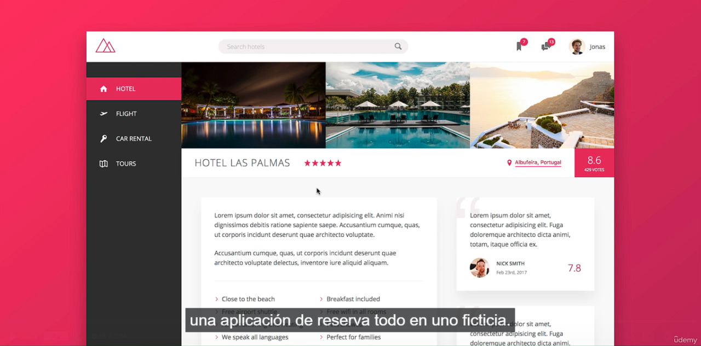

# MiniReto

This is a Mini Challenge for the second Sprint of Semillero de Desarrolladores.
The goal of this challenge is to recreate a hotel finder web site, where the user
selects the image of the hotel by clicking over it, and then the content of the
page changes accordingly to the selected hotels.
 
So the name of the hotel, location an description gets updated on click over
the image.
 
Other feature required by the challenge, is to hide/show the nav bar when the user 
click over it
 
 
